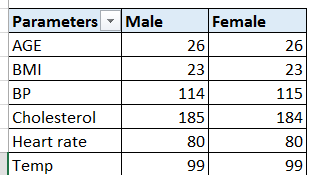
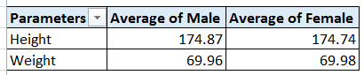
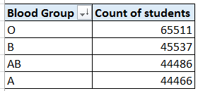
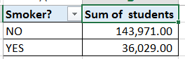
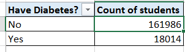

# Medical-Students-Data-Analysis
## Dataset medical students was made available by our Instructor. We are required to do the following
### Using the Medical Students Data, create Pivot Tables displaying the following:
Average values for the following for Male and Females (Age, BMI, Temperature, Heart Rate, Blood Pressure, and Cholesterol)

From the table above, it is quite noticeable that 04 parameters of 06 have thesame figures for both gender (Male and Female). For the blood pressure tab, one can clearly deduce that the average BP for Male medical students is 114 and that of female medical students 115 having a difference of 1. Average cholesterol for male students is 185 while that of female is 184 with of difference still of 01.

### Average Height and Weight for both Genders (in 2 decimal places)

This data shows that, there is only a slide difference of height and weight of the students. An Average male student's height is 174.87 slidely taller than an Average female of student with 174.74. The reverse is true with weight.

### Number of students across the different Blood Groups

From the above data, we can tell the highest number of students per blood group is 'O' with 65511 while blood group A recorded the lowest number of students with 44466.Blood group B and AB are dancing in between.It also shows that, 33% of the total population in the medical school have Blood group O while 22.2% of the population have Blood group A.

### Number of Students who smoke and those who don’t

from the data table, 143,971 students do not smoke giving us 72% of the population while 36,029 students smoke making up 18% of the students. 20,000 students did not specify whether they are smokers or not.

### Number of Students who have diabetes and those who don’t

161,986 students do not have diabetes while 18,014 students have diabetes. Looking at this data, 1/3 of the students are diabetes free.

